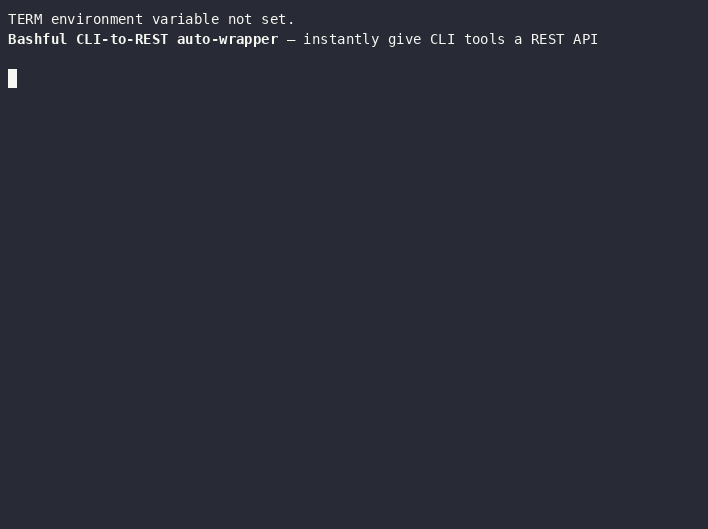

# Bashful — CLI-to-REST API Auto-Wrapper

[](https://opensource.org/licenses/MIT)
[](https://github.com/PIsberg/bashful-cli/actions/workflows/test.yml)
[](https://securityscorecards.dev/viewer/?uri=github.com/PIsberg/bashful-cli)
[](https://bun.sh/)
[](https://bun.sh/)
[](https://github.com/PIsberg/bashful-cli)

**Bashful** gives your CLI tools a REST API — no code required.

The name is a double meaning: it wraps **bash**ful tools (tools that only speak shell), and it does so quietly, without you having to write a single line of server code. You hand it a command name, and Bashful reads the `--help` output, figures out the flags, and instantly serves a REST API and a browser UI you can poke at.

Think of it as a shy CLI tool finding its voice over HTTP.

<!-- DEMO-GIF: generated by .github/workflows/demo.yml — run `gh workflow run demo.yml` to regenerate -->



---

## What it does

Most command-line tools are only accessible from a terminal. Bashful bridges that gap:

1. **Reads** the tool's `--help` output at startup.
2. **Parses** every flag — short (`-s`), long (`--silent`), typed (`--output <file>`), and boolean — into a JSON schema.
3. **Serves** a local REST API where each JSON key maps back to a CLI flag.
4. **Executes** the real command when you POST to the endpoint, streaming the output back as plain text.
5. **Shows** a browser UI (Swagger-style) auto-generated from the parsed schema so you can fill in flags and run commands without touching a terminal.

No config files. No code. Starts in milliseconds.

---

## Documentation

- **[Usage](docs/usage.md)** — invocation modes, endpoints, payload conventions, access control, environment variables.
- **[Architecture](docs/architecture.md)** — how the help text becomes a schema, how a payload becomes a command line, and the invariants that keep it safe.
- **[Testing](docs/testing.md)** — how the suite is organized and how to add to it.

---

## Prerequisites

- [Bun](https://bun.sh/) v1.0+

Install on Linux/macOS:
```bash
curl -fsSL https://bun.sh/install | bash
```

Install on Windows:
```powershell
powershell -c "irm bun.sh/install.ps1 | iex"
```

---

## ⚡ Add REST to Your CLI in 30 Seconds

**1. Install dependencies:**
```bash
bun install
```

**2. Start Bashful wrapping your CLI tool (e.g., `curl`):**
```bash
bun run bashful.ts curl
```

**3. Explore the dynamic Swagger-like Web UI:**
Open [http://localhost:3000](http://localhost:3000) in your browser to view the auto-generated dashboard where you can interactively run commands.

**4. Or interact with the auto-generated endpoints directly:**

* **Get the parsed flag schema:**
  ```bash
  curl http://localhost:3000/curl/schema
  ```

* **Execute `curl` over HTTP:**
  ```bash
  curl -X POST http://localhost:3000/curl \
    -H "Content-Type: application/json" \
    -d '{"silent": true, "output": "example.html", "_args": ["http://example.com"]}'
  ```

> [!TIP]
> The POST above translates dynamically to the native CLI invocation:
> `curl --silent --output example.html http://example.com`

> [!IMPORTANT]
> Bashful executes real commands, so it is hardened against the browser: no CORS by default, exec requires `POST` with `Content-Type: application/json`, the `Host` header must be loopback, and `GET` execution is off unless you pass `--allow-get`. See [Browser safety](docs/usage.md#browser-safety).

---

## Multiple commands

Use `\|` to wrap several tools at once. Each gets its own endpoint and a tab in the UI:

```bash
bun run bashful.ts curl \| wget \| ping
```

Endpoints created:
- `POST /curl` — execute curl
- `POST /wget` — execute wget
- `POST /ping` — execute ping
- `GET /<cmd>/schema` — parsed flag schema for each

---

## Invocation modes

**Direct mode** — Bashful appends `--help` automatically:
```bash
bun run bashful.ts curl
```

**Pipe mode** — provide the exact help command yourself (useful when `--help` fails or outputs to stderr):
```bash
bun run bashful.ts curl --help
bun run bashful.ts git log --help
```

Both modes can be mixed when using `\|`:
```bash
bun run bashful.ts curl --help \| wget
```

---

## Payload conventions (`POST /<command>`)

| Payload key | CLI result |
|---|---|
| `_args: ["http://example.com"]` | positional args, prepended before flags |
| `"silent": true` | `--silent` |
| `"output": "file.html"` | `--output file.html` |
| `"v": true` | `-v` (single-char keys become short flags) |
| `"silent": false` | *(omitted)* |

---

## Access control (whitelist / blacklist)

Bashful executes real commands, so you can restrict what it will run with an optional JSON config — both **which commands** are wrappable and **which flags (and combinations of flags)** each command accepts.

Bashful loads its config from, in order: `--config <file>`, `$BASHFUL_CONFIG`, or `./bashful.config.json` if it exists. With no config, nothing is restricted and behaviour is unchanged.

```bash
bun run bashful.ts --config bashful.config.json curl \| wget
```

See [`bashful.config.example.json`](bashful.config.example.json) for a working starting point.

### Config format

```json
{
  "mode": "blacklist",
  "commands": {
    "allow": ["curl", "wget"],
    "deny": ["rm", "sudo"]
  },
  "flags": {
    "*":    { "deny": ["config"] },
    "curl": {
      "allow": ["_args", "silent", "output"],
      "deny": ["upload-file"],
      "denyCombinations": [["output", "proxy"]],
      "allowCombinations": [["_args", "silent"], ["_args", "output"]]
    }
  }
}
```

| Key | Meaning |
|---|---|
| `mode` | `"blacklist"` (default) — everything is allowed unless denied. `"whitelist"` — nothing is allowed unless explicitly allowed. |
| `commands.allow` / `commands.deny` | Which commands may be wrapped at all. |
| `flags.<cmd>` | Flag rules for one command. The `"*"` key applies to every command and is merged with the command's own rules. |
| `flags.<cmd>.allow` / `.deny` | Individual flags. Naming an `allow` list whitelists that command's flags even in blacklist mode. |
| `flags.<cmd>.denyCombinations` | List of flag sets. A request is rejected if it uses **all** flags of any listed set — the flags remain fine on their own. |
| `flags.<cmd>.allowCombinations` | List of flag sets. A request is rejected unless every flag it uses fits inside **one** listed set. |

Rules use **payload key names**, not CLI spellings: write `output`, not `--output`. Positional arguments are governed under the name `_args`, and `"*"` in any list means "everything". Full reference: [docs/usage.md](docs/usage.md#access-control).

**Deny always beats allow.** A flag set to `false` builds to nothing, so it is ignored by the rules.

### How it is enforced

- **At startup** — wrapping a denied command is refused and Bashful exits with a non-zero status.
- **At request time** — a blocked payload gets `403 Forbidden` with a JSON `reason`, and the command never runs. This covers both `POST` bodies and `GET` query params, including keys that never appeared in the parsed schema.
- **In the schema and UI** — `GET /<cmd>/schema` only advertises the flags the policy permits, so the generated form can't offer a flag that would be rejected. Combination rules can't be expressed in a form, so those are enforced on the request.

> [!WARNING]
> This gates the flags Bashful passes to a command; it does not sandbox the command itself. A wrapped tool that can read files or reach the network can still do so within the flags you permit. Bashful binds to `127.0.0.1` by default for the same reason.

---

## Debug mode

Pass `--debug` anywhere before the command to log startup time, parsed flag counts, and each execution:

```bash
bun run bashful.ts --debug curl \| wget
```

---

## Running tests

```bash
bun test                       # everything
bun test -t "authorizeFlags"   # a single describe block or test
bunx tsc --noEmit              # typecheck (no build step)
```

Tests cover the pure functions at the core of Bashful — `splitSegments` (arg parsing), `parseSchema` (regex-based help text parsing), `buildCLIArgs` (payload → CLI translation), and the access-control layer (`parseConfig`, `authorizeCommand`, `authorizeFlags`, `filterSchema`) — plus integration tests that run the real server and check routing and policy enforcement end to end. See [docs/testing.md](docs/testing.md).

---

## Architecture

Everything lives in a single file: `bashful.ts`.

- **`splitSegments(args)`** — splits CLI args on `|` into per-command segments.
- **`parseSchema(helpText)`** — the "Bashful Regex" extracts short flags, long flags, value types (`<val>`, `[val]`, `ALL_CAPS`), and descriptions into a keyed schema object.
- **`buildCLIArgs(payload, schema)`** — translates a JSON payload back into a flat CLI argument array.
- **Access control** — `parseConfig` validates the policy file; `authorizeCommand` / `authorizeFlags` decide what may run; `filterSchema` hides forbidden flags from the schema and UI.
- **Server** — `Bun.serve` on port 3000. Routes: `GET /` (UI), `GET /<cmd>/schema`, `POST /<cmd>`.
- **Execution** — `Bun.spawn` runs the real command and streams stdout directly as the HTTP response.

Deeper dive — including the Bashful Regex, the enforcement layering, and the invariants worth not breaking: [docs/architecture.md](docs/architecture.md).

---

## License

[MIT](LICENSE) © Peter Isberg
